# 捷徑分帳

出國旅遊的多人分帳工具。用 **iPhone 內建的「捷徑」** 記帳，帳目自動存進 **Google 試算表**。

> A group expense splitter for trips using iPhone Shortcuts + Google Sheets. No app, no server, free.

 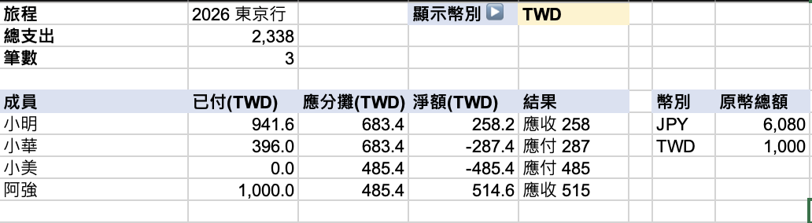
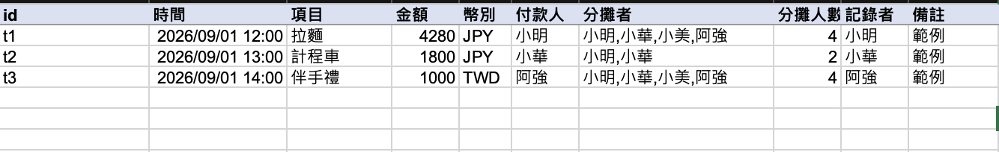

---

## 用了可以做到什麼

**📱 10 秒記一筆帳**
點一下主畫面上的「分帳」，依序回答：多少錢 → 哪種貨幣 → 誰付的 → 分給大家還是特定人 → 買了什麼。送出後手機會跳通知確認。

**👥 大家一起記、一起看**
每個人的手機都能記帳，所有紀錄即時出現在同一份 Google 試算表，誰都可以打開看。

**🧮 自動算出誰欠誰**
不用自己按計算機。隨時可以查帳，會直接告訴你「小華 → 小明：258 元」這種轉帳建議，而且轉帳次數最少。

**💱 多種貨幣也沒問題**
日圓、台幣混著記都可以，結算時可以切換成用日圓或台幣顯示。

**↩️ 記錯可以刪**
「刪除上一筆」只會刪掉你自己記的最後一筆，不會動到別人的帳。

**🔁 下次旅行繼續用**
開一份新的試算表就是新的旅程，朋友手機上的捷徑不用重新安裝。

## 運作方式

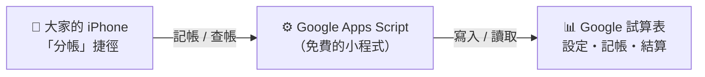

## 需要準備

- **iPhone**（分帳的人都要有，並且已安裝「捷徑」App，iPhone 預設就有）
- **Google 帳號**（只有建立分帳的人需要）
- **電腦**（建議用電腦做第一、二部分，畫面比較好操作）

## 下載檔案

| 檔案 | 用途 |
|---|---|
| [分帳範本.xlsx](sheets/分帳範本.xlsx) | 試算表公版 |
| [Code.gs](apps_script/Code.gs) | 要貼進 Google Apps Script 的程式 |
| [加入「分帳」捷徑](https://www.icloud.com/shortcuts/0dc18e09403448588dfa4df755e91b60) | 用 iPhone 點這個連結安裝捷徑 |

---

# 開始設定

整個設定只有「建立分帳的人」需要做一次，大約 15 分鐘。一起出遊的朋友只需要做 [第四部分](#第四部分分享給朋友) 的安裝。

## 第一部分：建立試算表

### 1. 上傳公版

1. 下載 [分帳範本.xlsx](sheets/分帳範本.xlsx)（進入頁面後按右上角的下載按鈕）。
2. 用電腦打開 [Google 雲端硬碟](https://drive.google.com)，登入你的 Google 帳號。
3. 點左上角 **「+ 新增」→「檔案上傳」**，選剛剛下載的 `分帳範本.xlsx`。
4. 上傳完成後，**雙擊**這個檔案打開。
5. 點上方選單 **「檔案」→「儲存為 Google 試算表」**。
6. 會自動打開一份新的試算表，**之後都用這一份**（原本的 xlsx 可以刪掉）。
> 點取代或是插入新工作表都可以 但匯入後多的這三個工作表不能改名稱

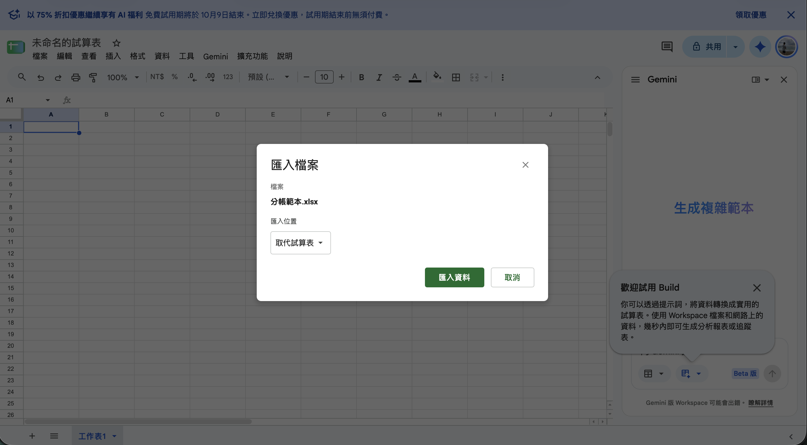

### 2. 填寫旅程資料

點下方的 **「設定」** 分頁，只要改 **黃色底的格子**：

| 位置 | 要填什麼 | 例子 |
|---|---|---|
| B2 | 旅程名稱 | 2026 東京行 |
| B3 | 去的國家 | 日本 |
| B4 | 最後結算用的貨幣 | TWD |
| D2 往下 | 一起去的人，**一格一個名字** | 小明、小華、小美… |
| A8、B8 往下 | 會用到的貨幣和匯率 | JPY、0.22 |

填貨幣的規則：

- **B 欄匯率**＝「1 塊這種貨幣等於多少結算貨幣」。例如 1 日圓 = 0.22 台幣，就填 `0.22`。
- **結算貨幣自己也要列一行，匯率填 `1`**（例如 `TWD`、`1`）。
- 最常用的貨幣放在最上面（A8），記帳時它會排第一個。

> ⚠️ 不要在「設定」分頁插入或刪除整列、也不要改分頁名稱，否則會讀不到資料。

### 3. 刪掉範例資料

「記帳」分頁裡有 3 筆範例資料，確認「結算」分頁有算出數字後就可以刪掉：

1. 點 **「記帳」** 分頁。
2. 點左邊的列號 **2**，按住 Shift 再點列號 **4**，選取這三列。
3. 按右鍵 → **「刪除第 2 - 4 列」**。

### 4. 記下試算表 ID

看瀏覽器上方的網址，大概長這樣：

```
https://docs.google.com/spreadsheets/d/1AbCdEfGhIjKlMnOpQrStUvWxYz/edit#gid=0
```

**`/d/` 和 `/edit` 中間那一串**（上面例子是 `1AbCdEfGhIjKlMnOpQrStUvWxYz`）就是 **試算表 ID**，先複製起來，等一下會用到。

### 5. 分享給朋友看

1. 點試算表右上角 **「共用」**。
2. 在「一般存取權」把「限制」改成 **「知道連結的任何人」**，權限選 **「檢視者」**。
3. 按 **「複製連結」**，之後傳給朋友，大家就能隨時看帳。

---

## 第二部分：建立記帳用的網址

這一步是在 Google 上放一個小程式，讓手機的捷徑可以把帳寫進試算表。只要照著貼上、按按鈕就好。

### 1. 貼上程式

1. 打開 [Google Apps Script](https://script.google.com)（用同一個 Google 帳號）。
2. 點左上角 **「+ 新專案」**。
3. 點上方的 **「未命名的專案」**，改名為 `分帳`，按「重新命名」。
4. 打開 [Code.gs](apps_script/Code.gs)，點右上角的「複製」按鈕複製全部內容。
5. 回到 Apps Script，把編輯區裡原本的文字 **全部刪掉**，再 **貼上** 剛剛複製的內容。
6. 按 **⌘ + S**（Windows 按 **Ctrl + S**）儲存。

### 2. 產生通行碼

通行碼是用來擋掉陌生人的密碼，會自動產生。

1. 在編輯區上方，找到「偵錯」右邊的 **下拉選單**，選 **`setupToken`**。
2. 按 **「▷ 執行」**。

   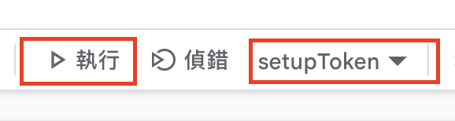

3. 第一次執行會跳出授權視窗：
   1. 按 **「審查權限」**，選你的 Google 帳號。
   2. 出現「Google 尚未驗證這個應用程式」→ 點左下角 **「進階」**。
   3. 點 **「前往「分帳」（不安全）」**。
   4. 按 **「允許」**。
   > 這是你自己剛建立的程式，所以 Google 會這樣提醒，是正常的。

   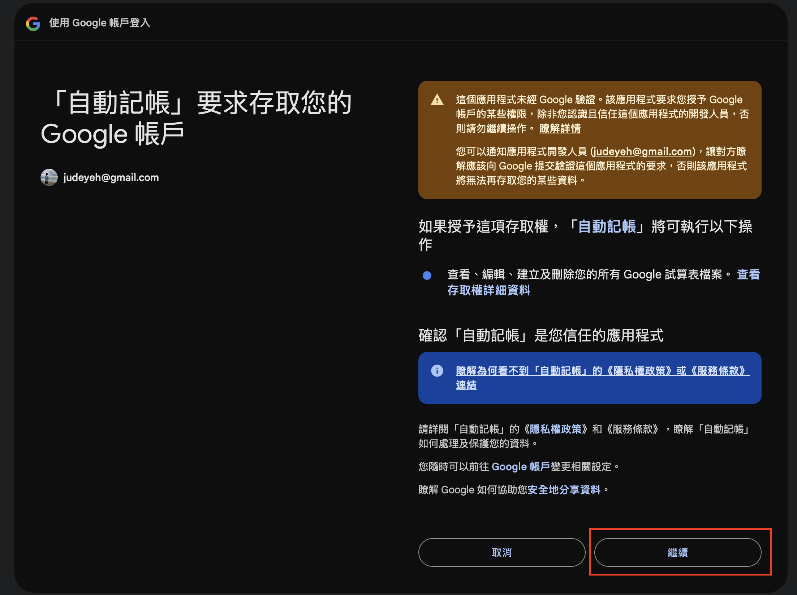
4. 畫面下方的「執行紀錄」會出現一行 **「已產生通行碼 TOKEN：xxxxxxxx」**，把這串通行碼 **複製起來**。
   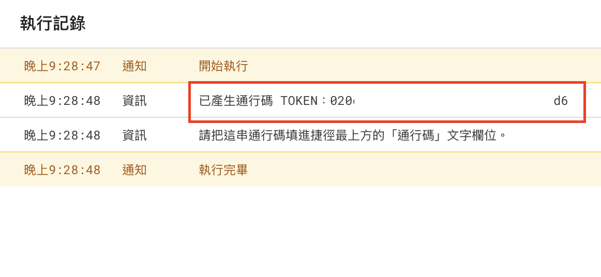

   > 如果這裡沒出現，可以點選最左邊選單的 **「專案設定」**，滑到最下方有個指令碼屬性，也可以看到通行碼 TOKEN
   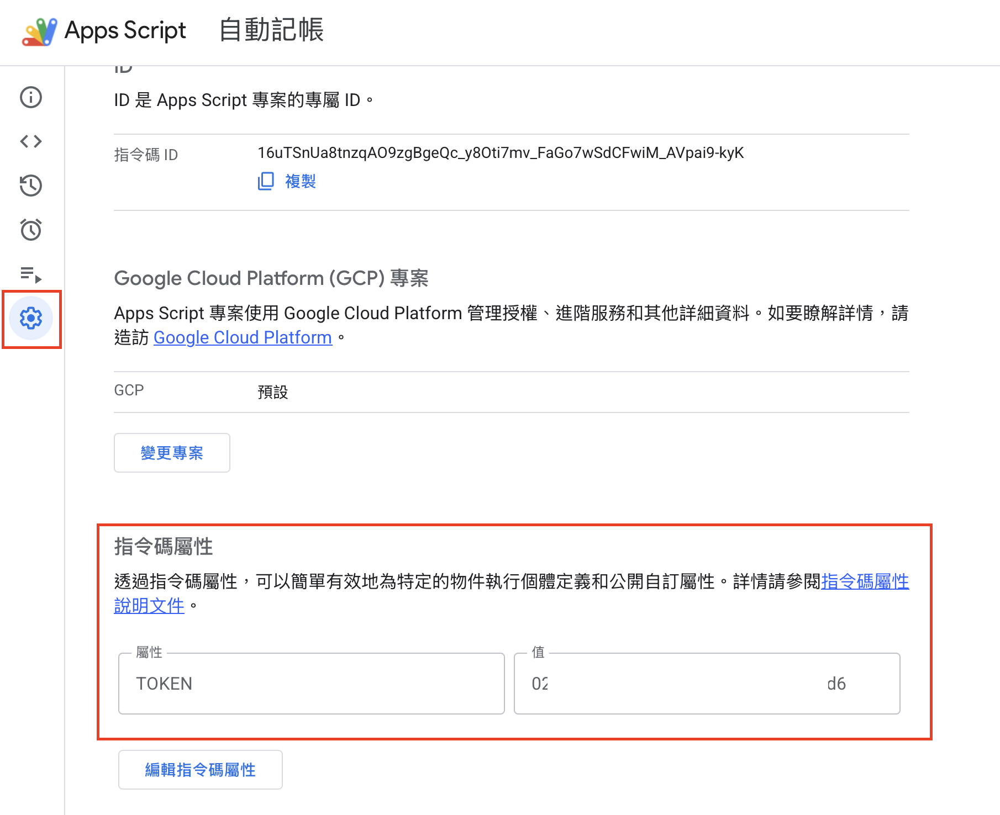

### 3. 連接試算表

1. 點左邊側欄的 **齒輪圖示「專案設定」**。
2. 往下捲到最底，點 **「新增指令碼屬性」**。
3. **屬性** 填 `SPREADSHEET_ID`（全部大寫，一字不差）。
4. **值** 貼上第一部分第 4 步的 **試算表 ID**。
5. 按 **「儲存指令碼屬性」**。
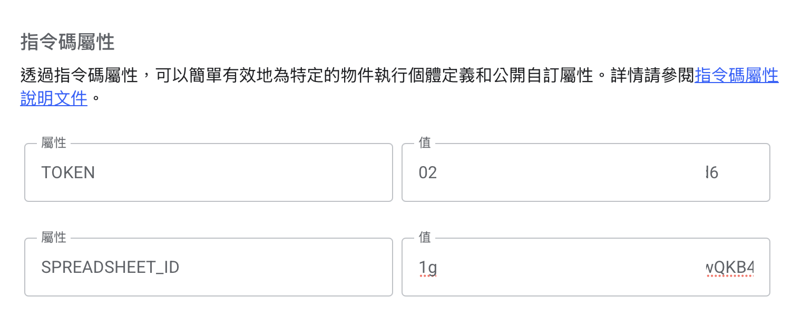

### 4. 檢查設定

1. 點左邊側欄的 **「< >」編輯器** 回到程式畫面。
2. 下拉選單選 **`checkSetup`**，按 **「▷ 執行」**。
3. 執行紀錄出現 **「設定正確 ✅」** 和你填的成員名字，就代表連上試算表了。
   如果出現錯誤，照錯誤訊息檢查試算表 ID 或「設定」分頁。
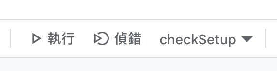

### 5. 發布成網址

1. 點右上角藍色的 **「部署」→「新增部署作業」**。
2. 點「選取類型」旁邊的 **齒輪** → 選 **「網頁應用程式」**。
3. 設定：
   - **說明**：隨便填，例如 `分帳`
   - **執行身分**：**我**
   - **誰可以存取**：**所有人**
   > ⚠️ 要選「所有人」，不是「擁有 Google 帳戶的任何人」，選錯手機會連不上。
4. 按 **「部署」**（如果又跳出授權，照第 2 步的方式允許）。
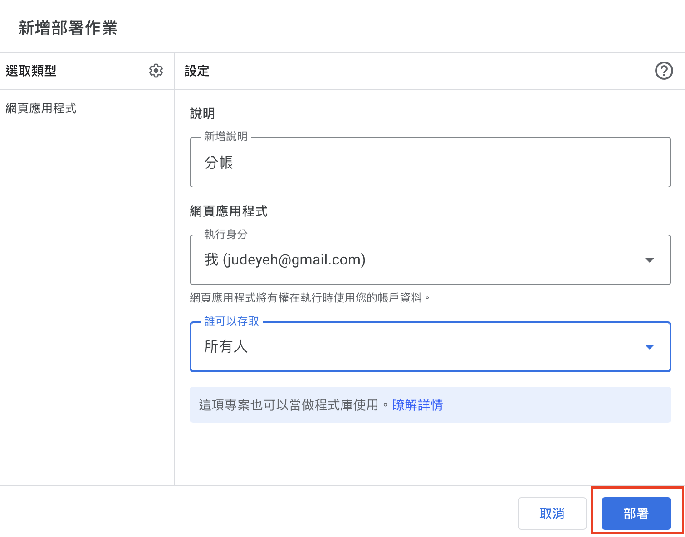

5. 畫面會顯示 **「網頁應用程式」網址**（`https://script.google.com/macros/s/.../exec`），按 **「複製」** 存起來。


**確認是否成功：** 打開瀏覽器的 **無痕視窗**，貼上這個網址。看到 **「分帳 API 運作中」** 就成功了 🎉

> 💡 現在你手上應該有兩樣東西：**網址** 和 **通行碼**。建議把它們傳到自己的 LINE 或備忘錄，下一步要在手機上貼上。

---

## 第三部分：安裝捷徑

### 1. 加入捷徑

1. 用 **iPhone** 點這個連結：**[👉 加入「分帳」捷徑](https://www.icloud.com/shortcuts/0dc18e09403448588dfa4df755e91b60)**
2. 按 **「加入捷徑」**。

### 2. 填入網址和通行碼

1. 打開 **「捷徑」App**。
2. 找到「分帳」，點卡片右上角的 **「⋯」** 進入編輯畫面。
3. 最上面有一段 **「⚙️ 設定區」** 的說明，下面有兩個文字欄位：
   - 第一個：把「請在這裡貼上你的 Apps Script 網址」整段刪掉，貼上 **網址**
   - 第二個：把「請在這裡貼上你的通行碼」整段刪掉，貼上 **通行碼 TOKEN**
4. 按右上角 **「完成」**。

> 沒填就執行的話，捷徑會跳出「還沒設定完成」的提醒，不會亂連線。

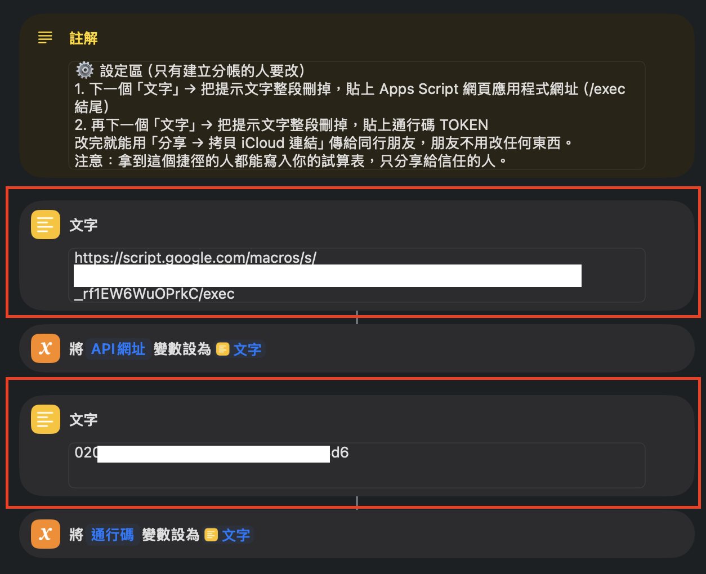

### 3. 第一次執行

1. 點一下 **「分帳」** 執行。
2. 如果跳出 **「允許傳送到 script.google.com？」**，按 **「永遠允許」**。
3. 選 **你是誰**（名單就是試算表裡填的成員）。
4. 看到 **「設定完成！」** 就可以開始記帳了。

> 💡 建議加到主畫面：長按「分帳」→「分享」→「加入主畫面」，以後點一下就能記帳。

---

## 第四部分：分享給朋友

### 建立分帳的人

1. 在「捷徑」App 長按 **「分帳」** → **「分享」** → **「拷貝 iCloud 連結」**。
2. 把這個連結和試算表連結一起傳到旅遊群組。

> ⚠️ 分享的是 **已經填好網址和通行碼** 的捷徑，只傳給一起去的朋友，不要公開貼出來。

### 朋友

1. 用 iPhone 點群組裡的連結 → **「加入捷徑」**。
2. 點一下 **「分帳」**，按「永遠允許」，選 **自己是誰**。
3. 完成！不用填任何網址或通行碼。

---

# 日常使用

點 **「分帳」** 會出現選單：

<!-- 📷 建議放圖：主選單截圖（docs/images/09-menu.png） -->

### ➕ 新增記帳

依序回答：

1. **多少錢？** 輸入金額
2. **幣別？** 選貨幣
3. **誰付的？** 選付錢的人
4. **怎麼分？**
   - **分攤給大家**：全部的人平分（大部分情況選這個）
   - **分攤給特定人**：勾選要分這筆的人，例如只有兩個人搭的計程車
5. **這是什麼？** 輸入項目，例如「拉麵」

送出後會跳通知：「已記錄：拉麵 JPY 4,280，小明 付款，4 人均分（每人約 TWD 235）」

### 📊 查帳

顯示目前的總支出、每個人付了多少、應該分攤多少，以及 **建議怎麼轉帳**。

### ↩️ 刪除上一筆

刪掉 **你自己** 記的最後一筆，記錯時用。

### 🔄 重新設定

重新選你是誰。換了新旅程、或當初選錯名字時使用。

## 小技巧

- **切換結算貨幣**：試算表「結算」分頁的 **E1** 格可以選貨幣，選 JPY 就全部用日圓顯示，手機查帳也會跟著換。
- **每個人金額不一樣**：一筆帳只能平分，想各付各的就拆成好幾筆，每筆只選那個人。
- **旅途中有人先還錢**：記一筆「還款」，付款人選還錢的人，「分攤給特定人」只勾收錢的人，帳就平了。
- **小地方記錯**：直接在試算表「記帳」分頁修改，結算會自動更新。

## 下一趟旅行

1. 打開舊的試算表 → **「檔案」→「建立副本」**。
2. 在新的副本：刪掉「記帳」分頁的舊紀錄，改「設定」分頁的旅程、成員、貨幣。
3. 複製新試算表的 **ID**，到 Apps Script 的 **「專案設定」→「指令碼屬性」**，把 `SPREADSHEET_ID` 的值換成新的（按「編輯指令碼屬性」修改後儲存）。
4. 請大家打開「分帳」選 **「重新設定」**。

捷徑和網址都不用換。

---

## 遇到問題

| 看到的訊息 | 怎麼辦 |
|---|---|
| 這個捷徑還沒設定完成 | 捷徑最上方的兩個文字欄位還沒填入網址和通行碼，照第三部分第 2 步做 |
| 通行碼錯誤 | 捷徑裡的通行碼貼錯了。到 Apps Script 再執行一次 `setupToken`，執行紀錄會顯示正確的通行碼 |
| 身份不在成員名單 | 試算表的成員改過或換了新旅程，在捷徑選「重新設定」 |
| 找不到「○○」分頁 | 試算表的分頁被改名了，改回「設定」、「記帳」、「結算」 |
| 無法從「RTF」轉換到「辭典」 | 捷徑收到的是網頁而不是資料。通常是網址貼錯，或部署時「誰可以存取」沒選「所有人」，照第二部分第 5 步檢查 |
| 無痕視窗打開網址要求登入 | 部署時「誰可以存取」沒選「所有人」。到「部署」→「管理部署作業」→ 鉛筆圖示 → 改成「所有人」，版本選「新版本」→ 部署 |
| 朋友的捷徑沒有更新 | iCloud 連結是分享當下的版本，改過捷徑要重新拷貝連結傳一次 |

## 注意事項

- 拿到你捷徑的人都可以寫入你的試算表，**只分享給一起旅行的朋友**。
- 身份是自己選的、沒有密碼，適合互相信任的朋友使用。
- 所有資料都在你自己的 Google 帳號裡。

## 授權

[MIT](LICENSE)
